# Prosodic Analysis

Tool to analyze general prosodic features of an audio speech corpora (in any language) in terms of intonation, intensity, duration and voice quality. 
This can be a useful tool for anyone working with speech datasets, and can help as a first general analysis of the prosodic characteristics of a dataset.

## Installation

The scripts rely in two main libraries: parselmouth (a Python wrapper of Praat: https://github.com/YannickJadoul/Parselmouth) and pysptk (a Python wrapper of the Speech ToolKit: https://pysptk.readthedocs.io/en/latest/index.html). Most of the analysis are done with the Praat wrapper, because although is slower than sptk, most phoneticians use it and in my experience is a very reliable tool.

Clone the repository and install the required dependencies with:

```bash
pip install -r requirements.txt
```


## Usage

To use the script you only need to modify the config.cfg file. This file contains the path to the audio corpora and the parameters to make the analysis.

```bash
python analyse.py -c config.cfg
```

The script runs 4 kinds of analysis (which can be turned on or off in the config file): pitch, duration (of speech and pauses separately), intensity and harmonic-to-noise ratio.
Make sure to change the path to your wave folder correctly in the config file. You also need to create a folder to save the plots and add the path in the same config file. Change the "title" field to name your corpus. These are the only things you might need to change for a new corpora. If you have a good idea about the range of pitch of your speaker you can change here, as well as the amount of smoothing of the F0 and other parameters.

```bash
# Waveforms path: path to the folder with .wav files, the script will only run in files with that extension

corpora = 'wavs_lj'

# Path to the folder Where to save plots

save_plots = 'plots_lj'
title = 'LJ'
```

# Output

Analysis are run both for each sentence and for the whole corpora.

One of the datasets I will use here to examplify is the LJ dataset that you can find here: https://keithito.com/LJ-Speech-Dataset/

For each sentence, the outputs are:
- Fundamental frequency contour (in Hz) of pitch, interpolated and smoothed contour plot for each sentence.
- Intensity contour (in dB) plots for each sentence.
- Zero coefficient plots for each sentence.
- HNR (in dB) plots for each sentence.

This is an example of the mentioned plots for one sentence in the LJ dataset.

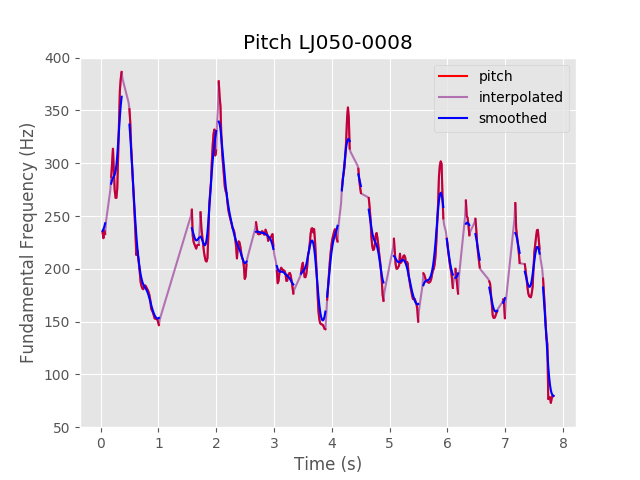  |  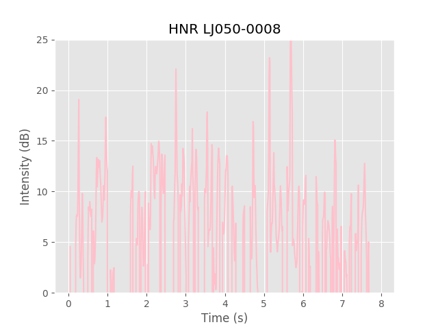
:-------------------------:|:-------------------------:
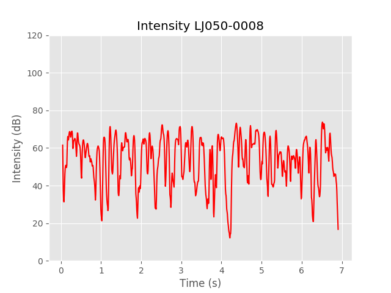  |  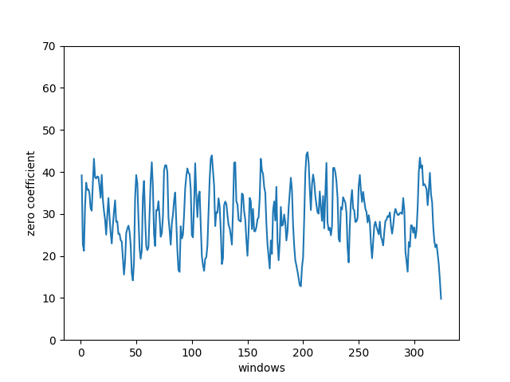

For the corpora, the outputs are:
- Normalized histogram of the distribution of fundamental frequency (in Hz) values.
- Normalized histogram of the distribution of intensity (in dB) values.
- Normalized histogram of the distribution of duration of speech segments (in seconds) values.
- Normalized histogram of the distribution of duration of silence segments (in seconds) values.
- Normalized histogram of the distribution of HNR (in dB) values.

These plots might allow a quick comparison between two corpora. For example, here there is a comparison of the general stats of 300 sentences from LJ-speech and 278 sentences (chapter 50) by me (Chilean Spanish plots). Although the number of sentences is similar, the distribution of durations is quite different, although LJ sentences come from audiobook data they had been chunked at silences and other boundaries, while my are prompts designed for unit selection TTS, without particularly controlling for length. Also, although both are females, my speech was intended to be neutral, while LJ is more expressive, which can be seen in the distribution of fundamental frequency and higher intensities. Finally, LJ is an American English speaker, while I'm a Chilean Spanish speaker (Please note the range of the axis differs for the two corpora).

  |  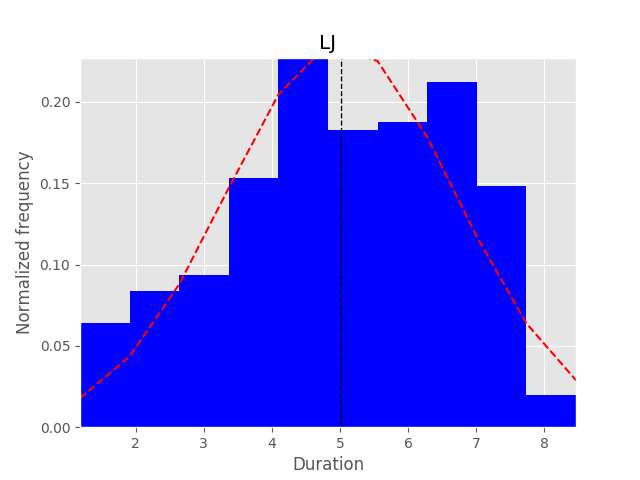
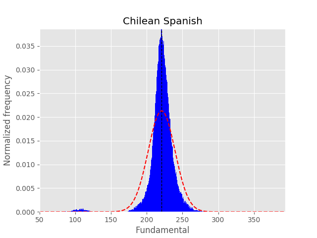  |  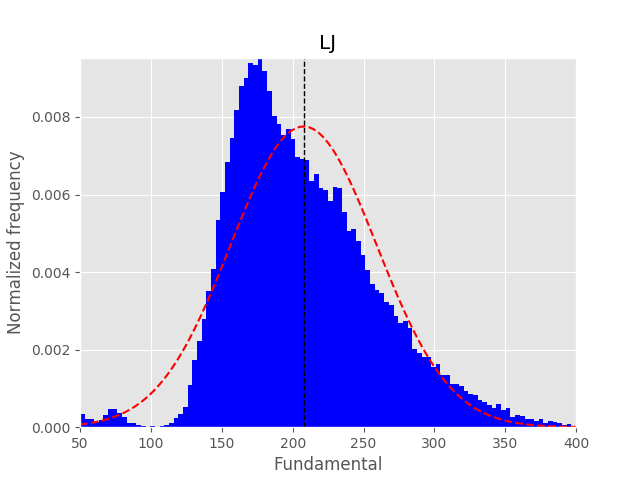
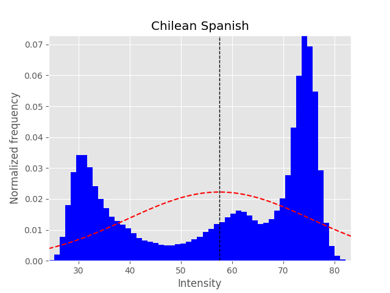  |  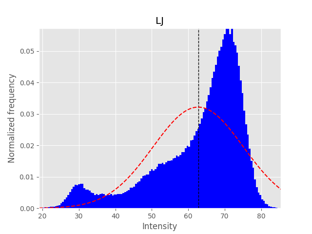
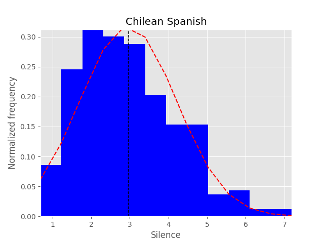  |  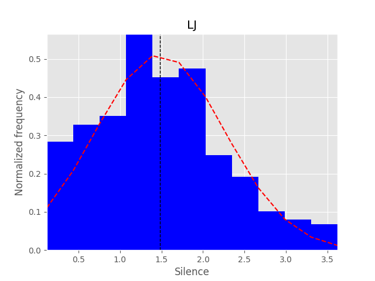
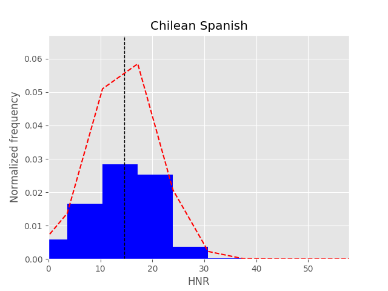  |  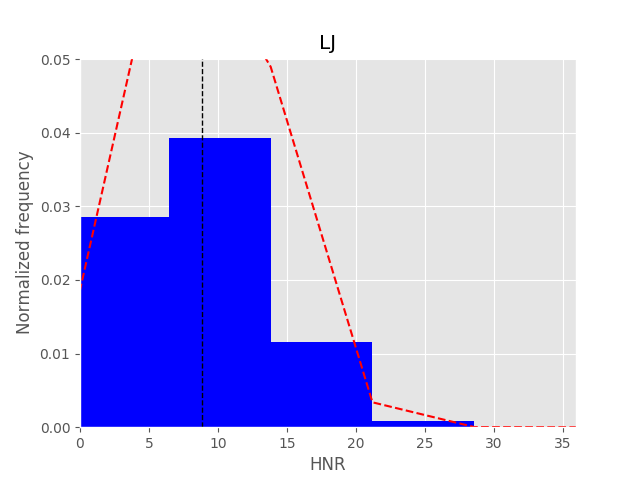
